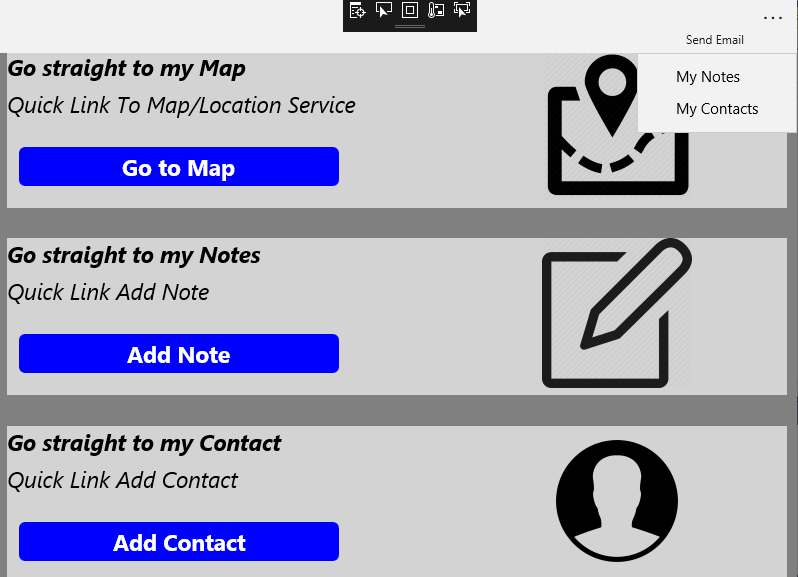
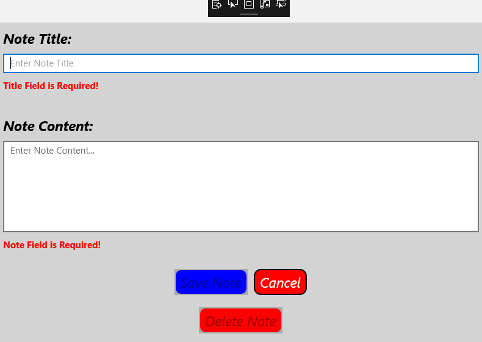
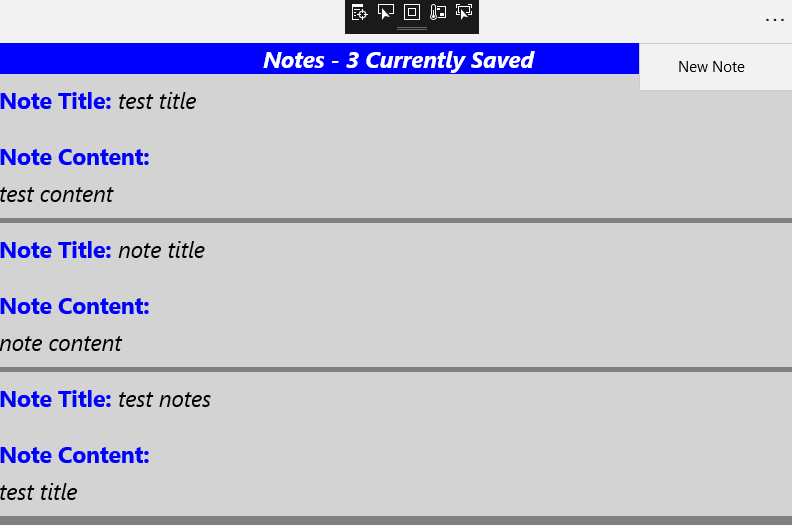
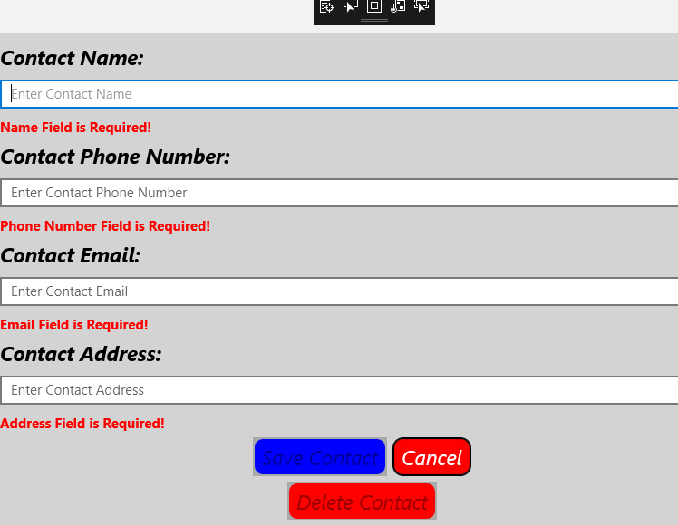
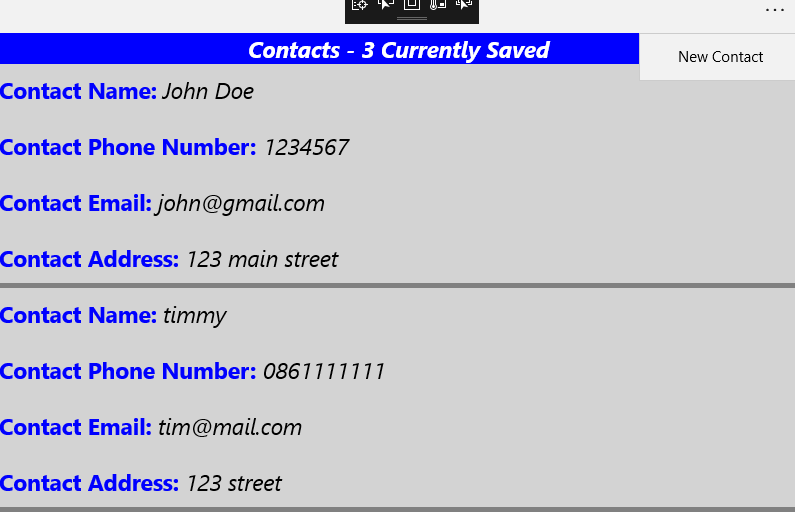
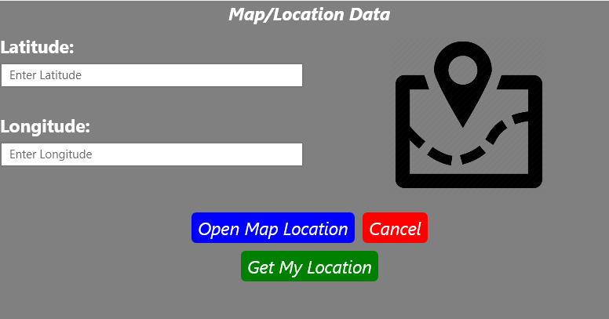
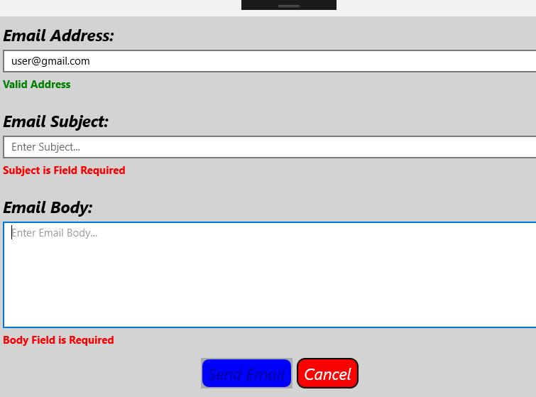

# XamarinProject

Note: This projects commits were previously started at this repository https://github.com/arronHealy/MobileAppsXamarinProject

Reason for this new repository is project namespace was to long for Android application

---------------------------------------------------------------------------------------------------

Xamarin Application for UWP and Android Platforms.

This project was part of a module of 3rd year Software Development Course in GMIT.

To Run project clone or download to a local folder and open with visual studio 2017.

--------------------------------------------------------------------------------------

This project is a Notes/Utility Mobile Application that uses C# as a shared code base to build a cross platform application for UWP and Android.

This Application uses SQLite as a local Database to store users notes and contacts.

The app makes use of the Xamarin Essentials package features to get a users location, open the map and also be able to send an email using devices native features.

# Application Flow Demo

## MainPage.xaml - xaml.cs

 

The Main Page of the application acts as an anchor page to all other parts of application through button links or through the apps toolbar.

 

 

## AddNotesPage.xaml - xaml.cs

 

Add Notes Page allows user to add a Note to an SQLite database also has error handling included

 

 

## NotesListPage.xaml - xaml.cs

 

Notes List Page lists users Notes from the SQLite database

 

 

## AddContactsPage.xaml - xaml.cs

 

Add Contacts Page allows user to add a Contact to an SQLite database also has error handling included.

 

 

## ContactsListPage.xaml - xaml.cs

 

Contacts List Page lists users Contacts from the SQLite database

 

 

## MapPage.xaml - xaml.cs

 

Map Page allows users to get current location and open in device native map app using xamarin essentials

 

 

## SendEmailPage.xaml - xaml.cs

 

Send Email Page allows users to compose and send email using device native email app using xamarin essentials

 

